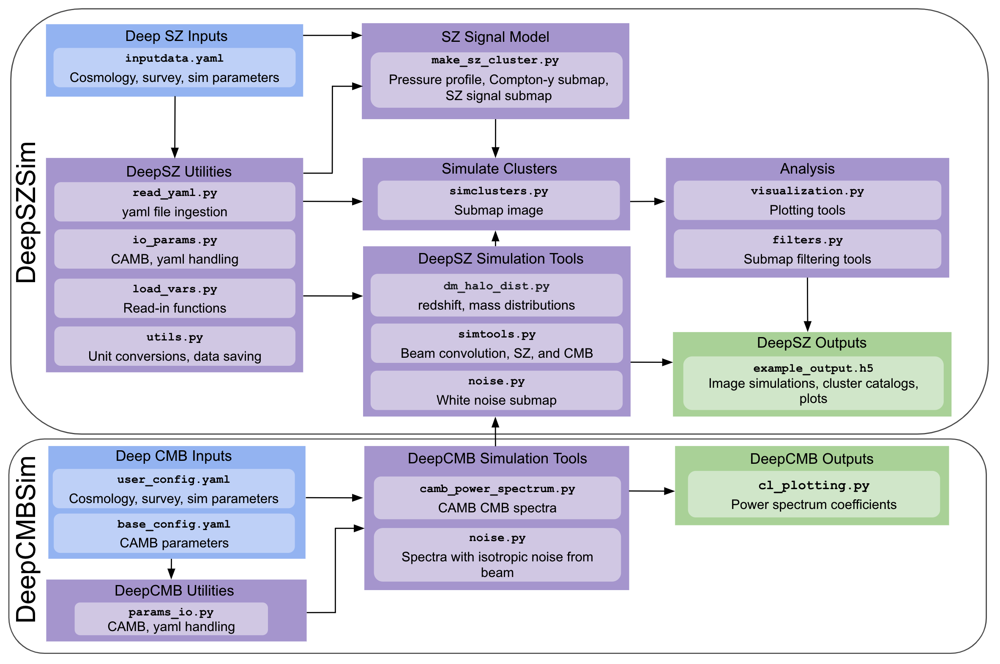

# `DeepSZSim`

Code for producing fast simulations of the SZ effect for galaxy halos of varying z, $M_{200}$, based on average thermal pressure profile fits from [Battaglia et al. 2012](https://ui.adsabs.harvard.edu/abs/2012ApJ...758...75B/abstract). Simulated submaps can include tSZ signal from these halos, simulated CMB, instrument beam convolution and white noise.

## Code Overview

The code is structured as depicted here: 
The CMB simulations are handled by [DeepCMBSim](https://www.github.com/deepskies/deepcmbsim), based on [CAMB](https://camb.info), and further by [pixell](https://github.com/simonsobs/pixell). The SZ cluster simluations are done in `make_sz_cluster.py` and instrumental effects are added in `filters.py` and `noise.py`.  

## Quickstart

### Installation 

We provide an environment specification file for `conda` or `mamba` users at `environment.yml`. With `conda`, an environment is created by `conda env create -f environment.yml`. With `micromamba` the `env` is omitted and a new environment is instead created with `micromamba create -f environment.yml`.

The simulated CMB signal relies on `camb` and utilities for saving rely on `h5py`.

From the top-level directory, you can do `pip install .`

### Usage

The usage of this code is documented in `notebooks/demo_simulation.ipynb`. A detailed walkthrough of the functions available in this code is in `notebooks/demo_full_pipeline.ipynb`.

A full list of potential inputs is documented in `settings/config.yaml` and you can edit `settings/inputdata.yaml` to reflect your desired simulation settings.  

`dm_halo_dist.py` generates a z, $M_{200}$ array. The functions in `make_sz_cluster.py` create pressure profiles, Compton-y, and SZ signal maps from these halos of various z, $M_{200}$ and produce the final simulated submaps. These submaps contain simulated CMB and simple instrument beam convolution from `simtools.py` and white noise from `noise.py`. Plotting tools are provided in `visualization.py`.

### Example

Let's say you wanted to produce 100 mock halos distributed across the redshift range 0.2<z<0.4 and with masses in the range 1e14<M200<1e15. To generate these halos and produce their simulated maps with SZ signal (along with CMB signal and noise parameters as specified in `Settings/inputdata.yaml`) you would call
```commandline
import deepszsim as dsz
tc0 = dsz.simulate_clusters(halo_params_dict={
                            'zmin':0.2, 'zmax':0.5,
                            'm200min_SM':1e14, 'm200max_SM':1e15
                            },
                            num_halos=100)
tc0.get_T_maps()
```
The clusters and their maps are now in a dictionary which is in a `clusters` attribute of the class instance `tc0`.

To access the clusters in this set, you can refer to the cluster ID, which itself is obtained from the first five digits of the cluster mass and two digits of the cluster redshift, followed by six random digits. For example, to access a dictionary of the maps and the parameters describing the eleventh cluster, you would do `tc0.clusters[tc0.id_list[11]]`. Alternately, to get the ''final'' temperature map (with noise) for the eleventh cluster, we also provide a convenience function: `tc0.ith_T_map(11)` is the same as `tc0.clusters[tc0.id_list[11]]['maps']['final_map']`.

## Citation

If you use this code in your research, please cite this GitHub repo. Please also make use of the citation instructions for `camb` provided [here](https://camb.info).

## Contributing

If you would like to contribute, please open a new [issue](https://github.com/deepskies/deepszsim/issues), and/or be in touch with the [authors](#contact)

## Contact

The code was developed by [Eve M. Vavagiakis](http://evevavagiakis.com), [Camille Avestruz](https://sites.google.com/view/camilleavestruz), Kush Banker, Ioana Cristescu, [Samuel D. McDermott](https://samueldmcdermott.github.io), [Brian Nord](http://briandnord.com/bio), Elaine Ran, Hanzhi Tan, and Brian Zhang, and is maintained by the [DeepSkies lab](https://deepskieslab.com)
